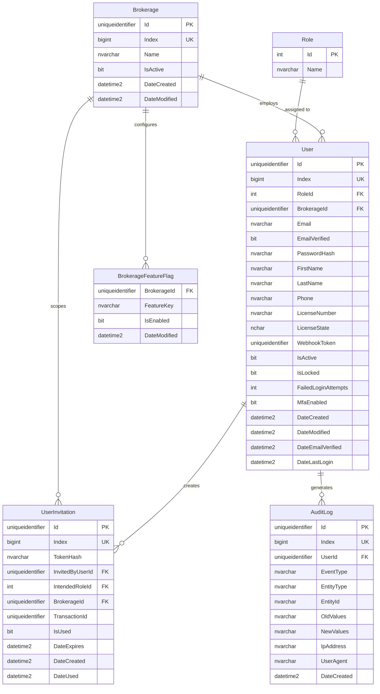
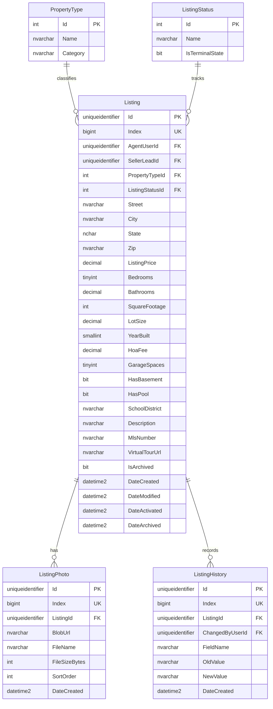
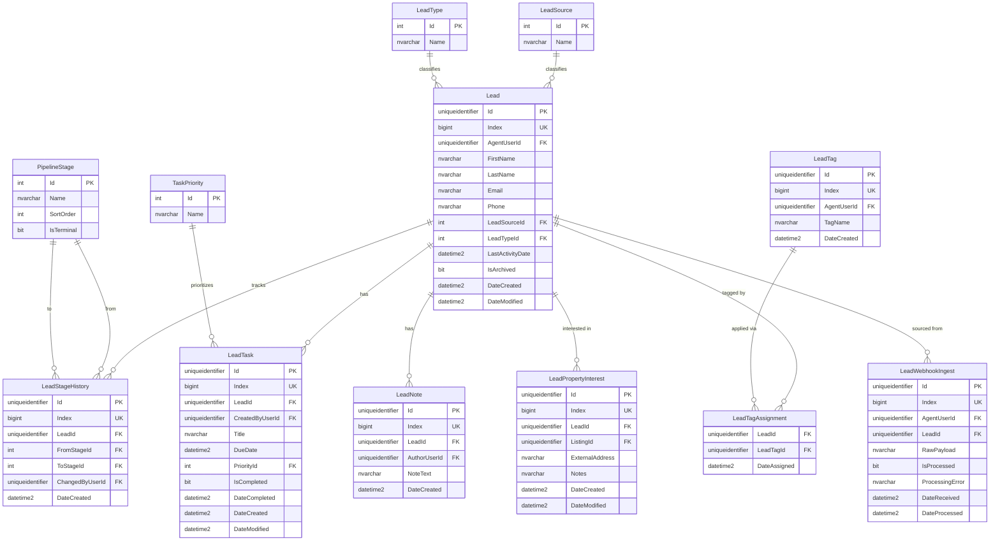
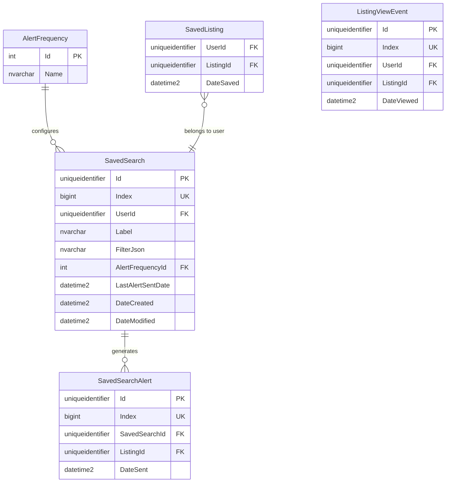
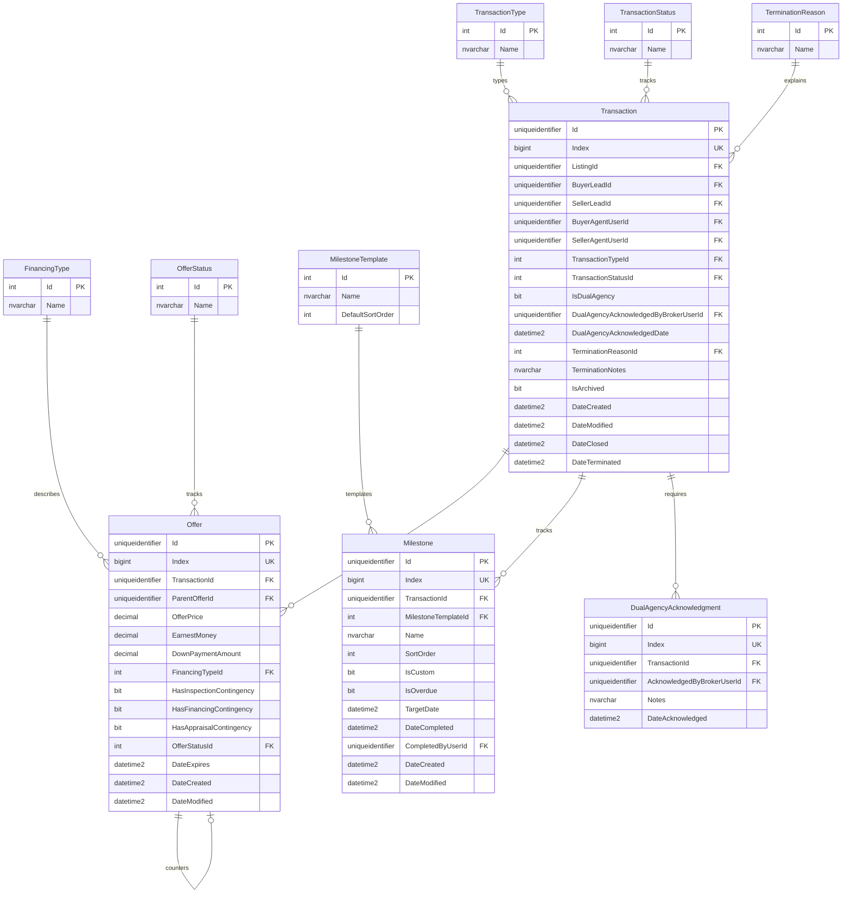
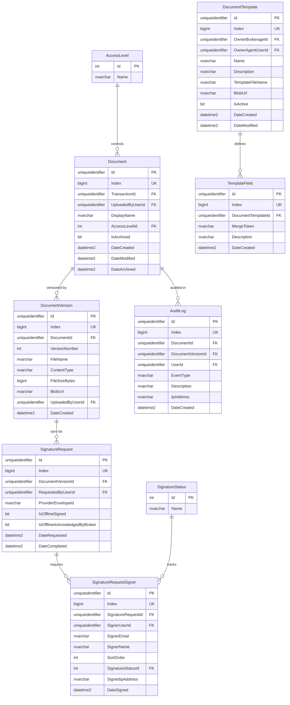
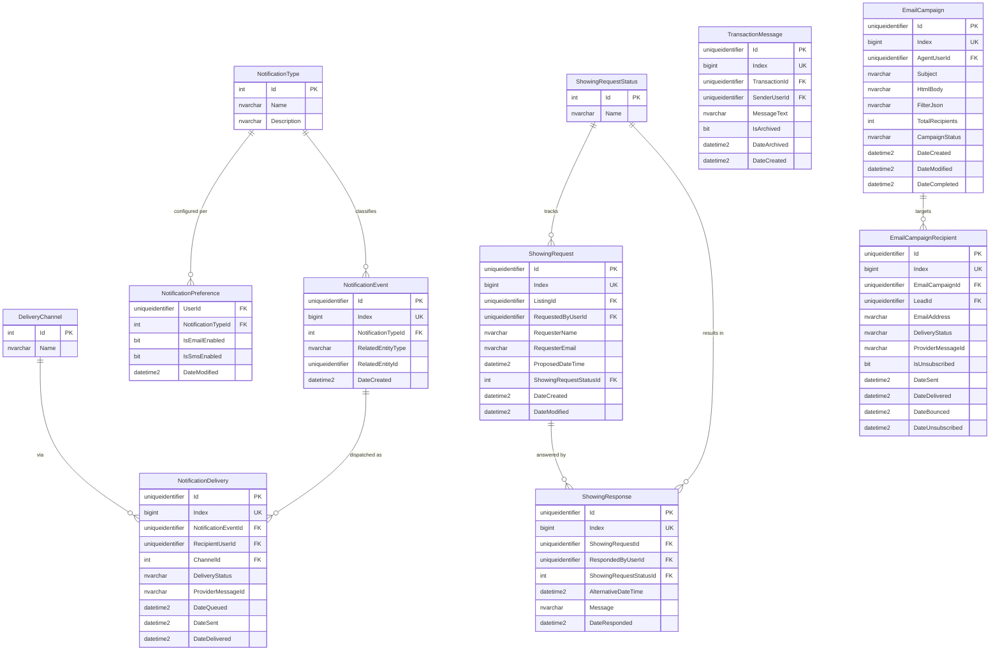

# Hestia — Database Design

**Version:** 1.0  
**Date:** 2026-06-07  
**Status:** Draft  
**Engine:** SQL Server (SSDT publish-to-sync model)

---

## Conventions

| Pattern | Rule |
|---|---|
| **Entity tables** | `[Id] UNIQUEIDENTIFIER NOT NULL` PK NONCLUSTERED (app-assigned) + `[Index] BIGINT IDENTITY(1,1)` unique clustered index |
| **Lookup tables** | `[Id] INT NOT NULL` PK CLUSTERED; values seeded in multiples of 1000 |
| **Junction tables** | Composite FK columns as PK CLUSTERED; no `[Index]`; one `Date<Verb>` membership column |
| **Append-only tables** | INSERT/SELECT grants only at DB level; no UPDATE or DELETE |
| **Dates** | `DATETIME2(3)` with `DEFAULT (SYSUTCDATETIME())`; named `Date<Verb>` |
| **Constraint names** | `PK_<schema>_<Table>`, `FK_<schema>_<Child>_<Parent>`, `DF_<schema>_<Table>_<Col>`, `UX_<schema>_<Table>_<Col>`, `IX_<schema>_<Table>_<Col>`, `CX_<schema>_<Table>_Index` |
| **Cascade rules** | Junction→parent: CASCADE both; owning parent→child: CASCADE; nullable FK: SET NULL; lookup FK: NO ACTION |

---

## Schemas

| Schema | Tables | Purpose |
|---|---|---|
| `auth` | 6 | Users, roles, brokerages, invitations, audit log |
| `listing` | 5 | Property listings, photos, edit history |
| `crm` | 12 | Lead pipeline, notes, tasks, tags, webhook ingest |
| `search` | 5 | Saved searches, alerts, favorites, view events |
| `txn` | 10 | Transactions, offers, milestones, termination |
| `doc` | 9 | Documents, versions, e-signatures, templates, audit |
| `comms` | 11 | Messages, notifications, showings, email campaigns |

---

## Cross-Schema Foreign Key Map

| Child Table | Column | References |
|---|---|---|
| `listing.Listing` | `AgentUserId` | `auth.User.Id` |
| `listing.Listing` | `SellerLeadId` | `crm.Lead.Id` (SET NULL) |
| `listing.ListingPhoto` | `ListingId` | `listing.Listing.Id` (CASCADE) |
| `listing.ListingHistory` | `ListingId` | `listing.Listing.Id` (CASCADE) |
| `listing.ListingHistory` | `ChangedByUserId` | `auth.User.Id` |
| `crm.Lead` | `AgentUserId` | `auth.User.Id` |
| `crm.LeadStageHistory` | `LeadId` | `crm.Lead.Id` (CASCADE) |
| `crm.LeadStageHistory` | `ChangedByUserId` | `auth.User.Id` |
| `crm.LeadNote` | `LeadId` | `crm.Lead.Id` (CASCADE) |
| `crm.LeadTask` | `LeadId` | `crm.Lead.Id` (CASCADE) |
| `crm.LeadPropertyInterest` | `ListingId` | `listing.Listing.Id` (SET NULL) |
| `crm.LeadWebhookIngest` | `LeadId` | `crm.Lead.Id` (SET NULL) |
| `search.SavedSearch` | `UserId` | `auth.User.Id` (CASCADE) |
| `search.SavedSearchAlert` | `SavedSearchId` | `search.SavedSearch.Id` (CASCADE) |
| `search.SavedSearchAlert` | `ListingId` | `listing.Listing.Id` (CASCADE) |
| `search.SavedListing` | `UserId` | `auth.User.Id` (CASCADE) |
| `search.SavedListing` | `ListingId` | `listing.Listing.Id` (CASCADE) |
| `search.ListingViewEvent` | `UserId` | `auth.User.Id` |
| `search.ListingViewEvent` | `ListingId` | `listing.Listing.Id` |
| `txn.Transaction` | `ListingId` | `listing.Listing.Id` |
| `txn.Transaction` | `BuyerLeadId` | `crm.Lead.Id` |
| `txn.Transaction` | `SellerLeadId` | `crm.Lead.Id` (SET NULL) |
| `txn.Transaction` | `BuyerAgentUserId` | `auth.User.Id` |
| `txn.Transaction` | `SellerAgentUserId` | `auth.User.Id` (SET NULL) |
| `txn.Offer` | `TransactionId` | `txn.Transaction.Id` (CASCADE) |
| `txn.Offer` | `ParentOfferId` | `txn.Offer.Id` (self-ref, NO ACTION) |
| `txn.Milestone` | `TransactionId` | `txn.Transaction.Id` (CASCADE) |
| `txn.Milestone` | `CompletedByUserId` | `auth.User.Id` (SET NULL) |
| `txn.DualAgencyAcknowledgment` | `TransactionId` | `txn.Transaction.Id` (CASCADE) |
| `txn.DualAgencyAcknowledgment` | `AcknowledgedByBrokerUserId` | `auth.User.Id` |
| `doc.Document` | `TransactionId` | `txn.Transaction.Id` (CASCADE) |
| `doc.Document` | `UploadedByUserId` | `auth.User.Id` |
| `doc.DocumentVersion` | `DocumentId` | `doc.Document.Id` (CASCADE) |
| `doc.DocumentVersion` | `UploadedByUserId` | `auth.User.Id` |
| `doc.SignatureRequest` | `DocumentVersionId` | `doc.DocumentVersion.Id` (CASCADE) |
| `doc.SignatureRequestSigner` | `SignatureRequestId` | `doc.SignatureRequest.Id` (CASCADE) |
| `doc.SignatureRequestSigner` | `SignerUserId` | `auth.User.Id` (SET NULL) |
| `doc.AuditLog` | `DocumentId` | `doc.Document.Id` (CASCADE) |
| `doc.DocumentTemplate` | `OwnerBrokerageId` | `auth.Brokerage.Id` (SET NULL) |
| `doc.DocumentTemplate` | `OwnerAgentUserId` | `auth.User.Id` (SET NULL) |
| `doc.TemplateField` | `DocumentTemplateId` | `doc.DocumentTemplate.Id` (CASCADE) |
| `comms.TransactionMessage` | `TransactionId` | `txn.Transaction.Id` (CASCADE) |
| `comms.TransactionMessage` | `SenderUserId` | `auth.User.Id` |
| `comms.NotificationPreference` | `UserId` | `auth.User.Id` (CASCADE) |
| `comms.NotificationDelivery` | `NotificationEventId` | `comms.NotificationEvent.Id` (CASCADE) |
| `comms.NotificationDelivery` | `RecipientUserId` | `auth.User.Id` |
| `comms.ShowingRequest` | `ListingId` | `listing.Listing.Id` (CASCADE) |
| `comms.ShowingRequest` | `RequestedByUserId` | `auth.User.Id` (SET NULL) |
| `comms.ShowingResponse` | `ShowingRequestId` | `comms.ShowingRequest.Id` (CASCADE) |
| `comms.ShowingResponse` | `RespondedByUserId` | `auth.User.Id` |
| `comms.EmailCampaign` | `AgentUserId` | `auth.User.Id` |
| `comms.EmailCampaignRecipient` | `EmailCampaignId` | `comms.EmailCampaign.Id` (CASCADE) |
| `comms.EmailCampaignRecipient` | `LeadId` | `crm.Lead.Id` (CASCADE) |

---

## Schema: auth

### ERD

### Table Inventory

| Table | Type | Notes |
|---|---|---|
| `auth.Role` | Lookup | Agent=1000, Broker=2000, Buyer=3000, Seller=4000 |
| `auth.Brokerage` | Entity | One per real estate firm |
| `auth.User` | Entity | All platform users; `WebhookToken` used for lead ingest |
| `auth.UserInvitation` | Entity | `TokenHash` is SHA-256 of the actual token URL param |
| `auth.AuditLog` | Entity (append-only) | Records all auth events immutably |
| `auth.BrokerageFeatureFlag` | Junction | Brokerage-level feature toggles |

---

## Schema: listing

### ERD

### Table Inventory

| Table | Type | Notes |
|---|---|---|
| `listing.PropertyType` | Lookup | SingleFamily=1000, Condo=2000, Townhome=3000, MultiFamily=4000; 5000+ reserved for commercial |
| `listing.ListingStatus` | Lookup | Draft=1000, Active=2000, Pending=3000, Sold=4000, Expired=5000, Withdrawn=6000 |
| `listing.Listing` | Entity | Core listing record; `SellerLeadId` SET NULL on lead delete |
| `listing.ListingPhoto` | Entity | Blob metadata only; binary in Azure Blob Storage |
| `listing.ListingHistory` | Entity (append-only) | Full field-level audit trail for all listing edits |

---

## Schema: crm

### ERD

### Table Inventory

| Table | Type | Notes |
|---|---|---|
| `crm.LeadSource` | Lookup | Website=1000, Referral=2000, OpenHouse=3000, SocialMedia=4000, Zillow=5000, RealtorCom=6000, Other=7000 |
| `crm.LeadType` | Lookup | Buyer=1000, Seller=2000 |
| `crm.PipelineStage` | Lookup | New=1000…Archived=8000; `IsTerminal=1` for InactiveLost and Archived |
| `crm.TaskPriority` | Lookup | Low=1000, Medium=2000, High=3000 |
| `crm.Lead` | Entity | `LastActivityDate` updated by app on any activity; `WebhookToken` on parent `auth.User` |
| `crm.LeadStageHistory` | Entity (append-only) | `FromStageId` nullable (NULL on first stage assignment) |
| `crm.LeadNote` | Entity (append-only) | No UPDATE or DELETE grants |
| `crm.LeadTask` | Entity | Mutable; `DateCompleted` set when `IsCompleted = 1` |
| `crm.LeadTag` | Entity | Unique per (AgentUserId, TagName) |
| `crm.LeadTagAssignment` | Junction | CASCADE both sides |
| `crm.LeadPropertyInterest` | Entity | `ListingId` nullable (external address supported) |
| `crm.LeadWebhookIngest` | Entity (append-only) | Raw payload archive; `LeadId` SET NULL if lead is later deleted |

---

## Schema: search

### ERD

### Table Inventory

| Table | Type | Notes |
|---|---|---|
| `search.AlertFrequency` | Lookup | Immediately=1000, DailyDigest=2000, WeeklyDigest=3000 |
| `search.SavedSearch` | Entity | `FilterJson` stores full filter state as JSON |
| `search.SavedSearchAlert` | Entity (append-only) | One row per listing per alert sent; prevents re-alerting |
| `search.SavedListing` | Junction | Buyer favorites; composite PK (UserId, ListingId) |
| `search.ListingViewEvent` | Entity (append-only) | High-volume; consider monthly partitioning in production |

---

## Schema: txn

### ERD

### Table Inventory

| Table | Type | Notes |
|---|---|---|
| `txn.TransactionType` | Lookup | Purchase=1000, Lease=2000 (reserved for commercial v2) |
| `txn.TransactionStatus` | Lookup | Active=1000, UnderContract=2000, Closed=3000, Terminated=4000 |
| `txn.FinancingType` | Lookup | Cash=1000, Conventional=2000, FHA=3000, VA=4000, Other=5000 |
| `txn.OfferStatus` | Lookup | PendingResponse=1000, Accepted=2000, Countered=3000, Rejected=4000, Expired=5000 |
| `txn.TerminationReason` | Lookup | FinancingFellThrough=1000…Other=6000 |
| `txn.MilestoneTemplate` | Lookup | 9 default milestones seeded; `DefaultSortOrder` determines pre-population order |
| `txn.Transaction` | Entity | `SellerLeadId` SET NULL; dual-agency gate enforced at app layer |
| `txn.Offer` | Entity | `ParentOfferId` self-reference (NO ACTION) for counter-offer chains |
| `txn.Milestone` | Entity | `MilestoneTemplateId` nullable (NULL for custom milestones) |
| `txn.DualAgencyAcknowledgment` | Entity (append-only) | One row per broker acknowledgment; transaction may have multiple if re-acknowledged |

---

## Schema: doc

### ERD

### Table Inventory

| Table | Type | Notes |
|---|---|---|
| `doc.AccessLevel` | Lookup | AgentOnly=1000, AgentBuyer=2000, AgentSeller=3000, AgentBuyerSeller=4000, AllParties=5000 |
| `doc.SignatureStatus` | Lookup | Pending=1000, Signed=2000, Declined=3000 |
| `doc.Document` | Entity | Metadata only; binary in Azure Blob Storage |
| `doc.DocumentVersion` | Entity | `VersionNumber` auto-incremented by app per document |
| `doc.SignatureRequest` | Entity | `ProviderEnvelopeId` from DocuSign callback |
| `doc.SignatureRequestSigner` | Entity | `SignerUserId` nullable (guest signers have no account) |
| `doc.AuditLog` | Entity (append-only) | No UPDATE or DELETE grants; covers all document access events |
| `doc.DocumentTemplate` | Entity | Either brokerage-owned OR agent-owned (not both) |
| `doc.TemplateField` | Entity | Merge token map (e.g., `{{property.address}}`) |

---

## Schema: comms

### ERD

### Table Inventory

| Table | Type | Notes |
|---|---|---|
| `comms.NotificationType` | Lookup | NewMessage=1000, DocumentUploaded=2000, SignatureRequested=3000, DocumentSigned=4000, MilestoneCompleted=5000, MilestoneOverdue=6000, OfferSubmitted=7000, OfferAccepted=8000 |
| `comms.DeliveryChannel` | Lookup | InApp=1000, Email=2000, SMS=3000 |
| `comms.ShowingRequestStatus` | Lookup | Pending=1000, Confirmed=2000, Declined=3000, AlternativeProposed=4000, Cancelled=5000 |
| `comms.NotificationPreference` | Junction | Composite PK (UserId, NotificationTypeId); defaults all enabled |
| `comms.TransactionMessage` | Entity (append-only) | No UPDATE or DELETE grants; channel locked when transaction terminated |
| `comms.NotificationEvent` | Entity | `RelatedEntityId` is GUID of the triggering entity (listing, transaction, etc.) |
| `comms.NotificationDelivery` | Entity | Updated by email provider webhook callbacks |
| `comms.ShowingRequest` | Entity | `RequestedByUserId` nullable for public (unauthenticated) requests |
| `comms.ShowingResponse` | Entity | One response per state change; multiple responses possible (confirm → cancel) |
| `comms.EmailCampaign` | Entity | `CampaignStatus`: Draft, Sending, Completed, Failed |
| `comms.EmailCampaignRecipient` | Entity | High-volume on large sends; `IsUnsubscribed` honored for all future campaigns |
